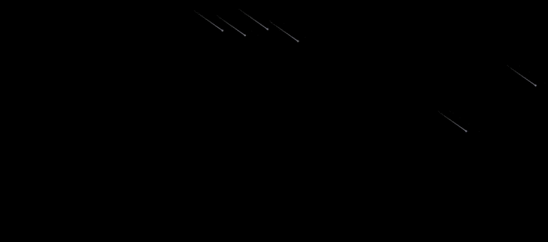

# Tailwind Meteors


This is a Tailwind, Next.js application that demonstrates moving meteors from top-left of the screen to the bottom-right of the screen.

## Meteors Animation

This component renders an animated meteor shower using Tailwind CSS for styling and React to manage the meteor elements. Each meteor has a unique animation, which makes the scene look dynamic and varied.

### How It Works

1. **Meteor Array Creation:**
   The meteors are created using the `Array.from()` method, which generates an array of 20 objects. Each object represents a meteor and includes the following properties:
   - `id`: A unique identifier for each meteor.
   - `top`: A random starting vertical position just above the visible area, calculated as a negative percentage (to start off-screen).
   - `left`: A random horizontal position within the screen width (0% to 100%).
   - `animationDelay`: A random delay before the meteor animation starts, ensuring that all meteors don't start falling at the same time.
   - `animationDuration`: The duration of the animation, which is randomized between 5 and 12 seconds for varied speeds.

2. **Rendering Meteors:**
   Inside the `return` statement, each meteor is rendered as a `span` element:
   - The `top` and `left` CSS properties determine the initial position of the meteor.
   - The `animationDelay` and `animationDuration` styles control when the animation starts and how long the meteor takes to cross the screen.
   - The outer `span` represents the meteor body (a small dot), and the inner `span` represents the meteor's tail (a line that fades out, created with a gradient background).

3. **Animation with Tailwind CSS:**
   The meteors use Tailwind's `absolute` and `animate-meteor` classes. The `animate-meteor` class is responsible for the animation logic (defined in your CSS), which moves the meteor from the top-left to the bottom-right of the screen in a diagonal path.

4. **Container Properties:**
   The parent container (`div`) uses `relative`, `h-full`, `w-full`, and `overflow-hidden` to ensure:
   - The meteors are positioned relative to the container.
   - The container fills the available space.
   - Any meteors that move out of the view are hidden (so they don’t overflow).

This implementation creates a meteor shower effect that works dynamically across any screen size.

### Animation Example:

```jsx
'use client'

import React from 'react';

export function Meteors() {
  const meteors = Array.from({ length: 20 }, (_, index) => ({
    id: index,
    top: -Math.floor(Math.random() * 5) + '%', // Starts slightly off the top of the screen
    left: Math.floor(Math.random() * 100) + '%', // Random position across the screen width
    animationDelay: Math.random() * 2 + 's', // Randomized delay for each meteor
    animationDuration: Math.floor(Math.random() * 8 + 5) + 's', // Random duration for varied speeds
  }));

  return (
    <div className="relative h-full w-full overflow-hidden bg-black">
      {meteors.map((meteor) => (
        <span
          key={meteor.id}
          className="absolute left-1/2 top-1/2 h-0.5 w-0.5 rotate-[215deg] animate-meteor rounded-full bg-slate-500 shadow-[0_0_0_1px_#ffffff10]"
          style={{
            top: meteor.top,
            left: meteor.left,
            animationDelay: meteor.animationDelay,
            animationDuration: meteor.animationDuration,
          }}
        >
          <span className="absolute top-1/2 -z-10 h-[1px] w-[50px] -translate-y-1/2 bg-gradient-to-r from-slate-500 to-transparent"></span>
        </span>
      ))}
    </div>
  );
}
```

This structure allows each meteor to appear randomly on the screen and animate at different speeds, creating a natural meteor shower effect.

## Getting Started

This is a [Next.js](https://nextjs.org) project bootstrapped with [`create-next-app`](https://nextjs.org/docs/app/api-reference/cli/create-next-app).

First, run the development server:

```bash
npm run dev
# or
yarn dev
# or
pnpm dev
# or
bun dev
```

Open [http://localhost:3000](http://localhost:3000) with your browser to see the result.

You can start editing the page by modifying `app/page.tsx`. The page auto-updates as you edit the file.

This project uses [`next/font`](https://nextjs.org/docs/app/building-your-application/optimizing/fonts) to automatically optimize and load [Geist](https://vercel.com/font), a new font family for Vercel.

## Learn More

To learn more about Next.js, take a look at the following resources:

- [Next.js Documentation](https://nextjs.org/docs) - learn about Next.js features and API.
- [Learn Next.js](https://nextjs.org/learn) - an interactive Next.js tutorial.

You can check out [the Next.js GitHub repository](https://github.com/vercel/next.js) - your feedback and contributions are welcome!

## Deploy on Vercel

The easiest way to deploy your Next.js app is to use the [Vercel Platform](https://vercel.com/new?utm_medium=default-template&filter=next.js&utm_source=create-next-app&utm_campaign=create-next-app-readme) from the creators of Next.js.

Check out our [Next.js deployment documentation](https://nextjs.org/docs/app/building-your-application/deploying) for more details.

## License

This project is licensed under the MIT License - see the [LICENSE](LICENSE) file for details.
